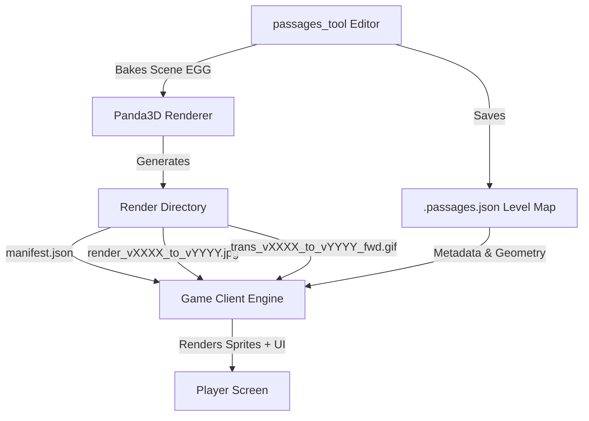
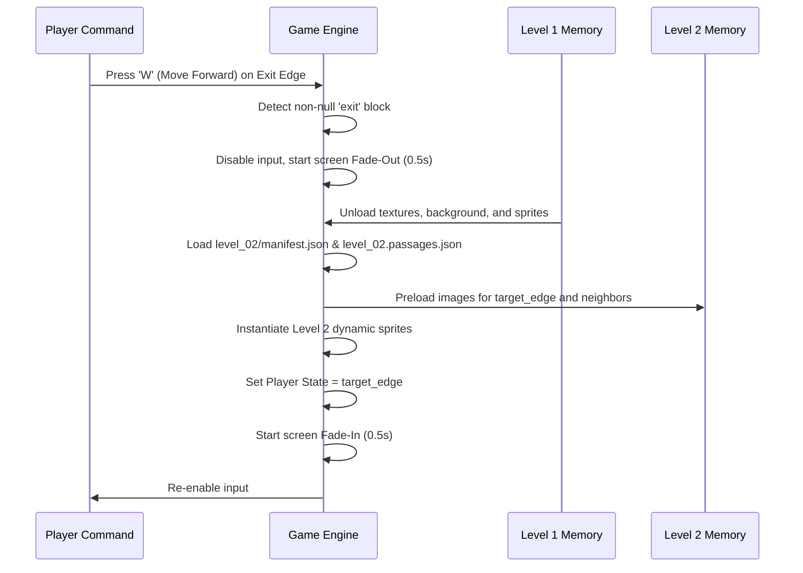

# Passages Minigame: Technical Interface Specification

This document provides a complete technical interface specification for the **Passages Minigame** developer. It outlines the schema of the assets produced by the `passages_tool`, details the state machine and movement mathematics, describes how to handle multi-level transitions, and defines a coordinate projection model to dynamically render interactive 2.5D sprites (characters, items, levers) on top of the pre-rendered slide backgrounds.

---

## 1. System Architecture Overview

The `passages_tool` compiles and bakes vector dungeons into discrete, pre-rendered viewpoints and transition animations. The game client operates as a **pseudo-3D slide-show engine** (similar to classic dungeon crawlers like *Dungeon Master* or *Eye of the Beholder*).



---

## 2. Asset Structure & Specifications

When a level is fully built and baked, it yields a unified directory structure containing three main elements:
1. **The Level Manifest (`manifest.json`)**: Contains viewpoint coordinate details and metadata.
2. **Pre-rendered Viewpoint Backgrounds (`render_vXXXX_to_vYYYY.jpg`)**: High-quality compressed JPEG backdrops.
3. **Traversal Transitions (`trans_vXXXX_to_vYYYY_fwd.gif`)**: Traversal animation frames shown during forward movement.
4. **The Map Source File (`[level_name].passages.json`)**: Raw geometry data used for pathfinding, collision detection, and spatial queries.

### Directory Layout
```text
game_assets/
└── levels/
    └── level_01/
        ├── manifest.json
        ├── level_01.passages.json
        ├── renders/
        │   ├── render_v0000_to_v0001.jpg
        │   ├── render_v0001_to_v0002.jpg
        │   └── ...
        └── transitions/
            ├── trans_v0000_to_v0001_fwd.gif
            ├── trans_v0000_to_v0001_rev.gif
            └── ...
```

---

## 3. JSON Data Schemas

### 3.1. The Render Manifest (`manifest.json`)
The manifest maps directed traversal edges (gaze directions) in the level to image assets, world coordinates, and precalculated visible anchor locations.

```json
{
  "v0000_to_v0001": {
    "image_path": "render_v0000_to_v0001.jpg",
    "eyepoint_xyz": [0.0, 0.0, 1.2],
    "facing_xyz": [0.0, 4.0, 1.2],
    "rendered": true,
    "flicker": null,
    "exit": null,
    "visible_anchors": {
      "anchor_07": {
        "screen_x": -0.2543,
        "screen_y": 0.0812,
        "scale": 0.6521,
        "distance": 3.421
      }
    }
  },
  "v0001_to_v0002": {
    "image_path": "render_v0001_to_v0002.jpg",
    "eyepoint_xyz": [0.0, 4.0, 1.2],
    "facing_xyz": [3.0, 4.0, 1.2],
    "rendered": true,
    "flicker": {
      "type": "sine",
      "speed": 2.5,
      "intensity_min": 0.7,
      "intensity_max": 1.0
    },
    "exit": {
      "target_level": "level_02",
      "target_edge": "v0000_to_v0001"
    },
    "visible_anchors": {}
  }
}
```

#### Field Details
* **`image_path`** (`string`): The filename of the viewpoint background image inside the renders directory.
* **`eyepoint_xyz`** (`[float, float, float]`): The 3D coordinate of the camera (Z-up system, where $Z$ is height).
* **`facing_xyz`** (`[float, float, float]`): The 3D target coordinate the camera is looking toward.
* **`flicker`** (`object | null`): Optional lighting behavior metadata. If non-null, the game client should dynamically modulate the screen exposure/brightness over time to simulate a flickering torch or broken light source.
* **`exit`** (`object | null`): Level transition portal. Indicates that moving forward along this edge triggers a load of a new level.
* **`visible_anchors`** (`object`): Dictionary mapping visible `anchor_id`s to their perspective screen-space projection parameters:
  * **`screen_x`** (`float`): Horizontal position in normalized screen space $[-1.0, 1.0]$. A value of `0.0` is exactly in the center of the screen, `-1.0` is the left edge, and `1.0` is the right edge.
  * **`screen_y`** (`float`): Vertical position in normalized screen space $[-1.0, 1.0]$. A value of `0.0` is exactly in the center of the screen, `-1.0` is the bottom edge, and `1.0` is the top edge.
  * **`scale`** (`float`): Depth-based scale multiplier ($1 / d$, where $d$ is distance) used to size the 2D billboard sprite proportionally in the viewport.
  * **`distance`** (`float`): The distance in meters from the camera viewpoint to the anchor.

---

### 3.2. The Map File (`[level_name].passages.json`)
Contains the vector description of the level. While the background is pre-rendered, the game client parses the `polylines` array to extract pathfinding graphs and collision walls.

```json
{
  "version": 2,
  "meta": {
    "name": "Dungeon Entrance",
    "author": "Designer A",
    "wall_height": 2.5,
    "eye_height": 1.2,
    "fov_h": 90.0,
    "fov_v": 67.5,
    "pixels_per_meter": 256.0,
    "fog_start": 4.0,
    "fog_end": 12.0,
    "floor_texture": "stone_floor.png",
    "ceiling_texture": "stone_ceiling.png"
  },
  "polylines": [
    {
      "id": "eyepath_0",
      "type": "eyepath",
      "vertices": [
        [0.0, 0.0],
        [0.0, 4.0],
        [3.0, 4.0]
      ],
      "edges": [
        [0, 1],
        [1, 0],
        [1, 2],
        [2, 1]
      ]
    },
    {
      "id": "anchor_07",
      "type": "anchor",
      "position": [1.5, 2.0],
      "z_offset": 0.0,
      "radius": 0.5,
      "max_distance": 10.0,
      "fov_limit": 45.0,
      "sprite_count": 1
    }
  ]
}
```

#### Eyepath Navigation Nodes
* **`vertices`** (`[[float, float], ...]`): $(x, y)$ coordinates in world space representing path junction points.
* **`edges`** (`[[int, int], ...]`): Directed paths connecting vertices. An entry `[0, 1]` means a player can stand at vertex `0` and look toward vertex `1` (which matches the manifest key `v0000_to_v0001`).

#### Sprite Anchor Slots
* **`position`** (`[float, float]`): $(x, y)$ coordinate of the anchor center in world space.
* **`z_offset`** (`float`): Height offset above the floor (default: `0.0`).
* **`radius`** (`float`): Bounding radius of the sprite's occupancy/interaction area (default: `0.5`).
* **`max_distance`** (`float`): Maximum distance from which a sprite at this anchor is visible (default: `10.0`).
* **`fov_limit`** (`float | null`): Optional restriction on horizontal view angle relative to camera gaze (null uses default camera horizontal FOV).
* **`sprite_count`** (`int`): Maximum capacity of dynamic sprites allowed at this slot (default: `1`).

---

## 4. Player State & Traversal Logic

The player's state is defined by a single directed edge in the active level:
$$\text{State} = (V_{\text{current}}, V_{\text{facing}})$$

### 4.1. Keyboard Controls and Graph Queries
* **Turn Left / Right**: 
  1. Query all outgoing edges from $V_{\text{current}}$:
     $$E_{\text{out}} = \{ (V_{\text{current}}, V_{\text{neighbor}}) \in \text{Edges} \}$$
  2. Compute the horizontal angle for each target vertex relative to the current facing direction.
  3. Sort the candidates clockwise.
  4. Select the next neighbor in the sorted list depending on the turn direction (Left = counter-clockwise, Right = clockwise).
  5. Transition the state instantly or via a cross-fade to $(V_{\text{current}}, V_{\text{neighbor}})$.
* **Move Forward**:
  1. Retrieve the exit configuration of the current edge: $(V_{\text{current}}, V_{\text{facing}})$. If it contains an `exit` block, trigger the **Level Transition Sequence** (see Section 5).
  2. Otherwise, check if there is an edge starting from $V_{\text{facing}}$ that continues in the same general direction:
     $$E_{\text{forward}} = \{ (V_{\text{facing}}, V_{\text{next}}) \in \text{Edges} \}$$
  3. If $E_{\text{forward}}$ contains candidates, select $V_{\text{next}}$ that minimizes the angle deviation from the current heading:
     $$\vec{u} = V_{\text{facing}} - V_{\text{current}}, \quad \vec{v} = V_{\text{next}} - V_{\text{facing}}$$
     $$\theta = \arccos\left(\frac{\vec{u} \cdot \vec{v}}{\|\vec{u}\| \|\vec{v}\|}\right)$$
  4. Play transition GIF `trans_v[V_current]_to_v[V_facing]_fwd.gif` on the screen.
  5. Update the player state to:
     $$\text{State}_{\text{new}} = (V_{\text{facing}}, V_{\text{next}})$$
     Once the transition completes, swap the screen background to the static image `render_v[V_facing]_to_v[V_next].jpg`.

---

## 5. Multi-Level Architecture & Movement

When a player steps onto an edge containing a portal, the game switches levels:



---

## 6. Dynamic Sprite Projection (2.5D Billboarding)

Because characters, items, and interactive obstacles (like chests) are dynamic and not baked into the static background, the engine must project and draw them as 2.5D billboard sprites on top of the active background slide.

### 6.1. Projection Mathematics
To draw a sprite located at world coordinate $\vec{P}_{\text{sprite}} = (x_p, y_p, z_p)$ relative to the player standing at camera position $\vec{C} = (x_c, y_c, z_c)$ looking at $\vec{T} = (x_t, y_t, z_t)$ with vertical height $z_c = z_t = \text{meta.eye\_height}$:

#### Step 1: Compute the Camera Coordinate Frame
1. **Forward Gaze Vector** ($\vec{F}$):
   $$\vec{F} = \frac{\vec{T} - \vec{C}}{\|\vec{T} - \vec{C}\|}$$
2. **Up Vector** ($\vec{U}$):
   $$\vec{U} = (0, 0, 1)$$
3. **Right Vector** ($\vec{R}$):
   $$\vec{R} = \vec{F} \times \vec{U} = (F_y, -F_x, 0)$$

#### Step 2: Transform Sprite into Camera Space
Compute the relative vector $\vec{D} = \vec{P}_{\text{sprite}} - \vec{C}$. Project $\vec{D}$ onto the camera coordinate axes to calculate depth ($d$), horizontal offset ($x_{\text{cam}}$), and vertical offset ($y_{\text{cam}}$):
$$d = \vec{D} \cdot \vec{F} \quad (\text{Depth along gaze line})$$
$$x_{\text{cam}} = \vec{D} \cdot \vec{R} \quad (\text{Lateral offset})$$
$$y_{\text{cam}} = \vec{D} \cdot \vec{U} \quad (\text{Vertical offset})$$

> [!IMPORTANT]
> If $d \le 0.1$, the sprite is behind or extremely close to the camera. The engine must skip rendering it.

#### Step 3: Perspective Projection to Screen Space
Using the level's Field of View parameters (`fov_h` and `fov_v` converted to radians: $\phi_h, \phi_v$), project to screen coordinates $(x_s, y_s)$ on a viewport of size $W \times H$ (e.g., $800 \times 600$):

1. **Calculate Normalized Coordinates** ($x_n, y_n$):
   $$x_n = \frac{x_{\text{cam}}}{d \cdot \tan(\phi_h / 2)}$$
   $$y_n = \frac{y_{\text{cam}}}{d \cdot \tan(\phi_v / 2)}$$
2. **Convert to Screen Pixels** ($x_s, y_s$):
   $$x_s = \frac{W}{2} \cdot (1 + x_n)$$
   $$y_s = \frac{H}{2} \cdot (1 - y_n)$$
3. **Calculate Scale Factor** ($S$):
   To scale the sprite size proportionally with distance, compute $S$:
   $$S = \frac{1}{d}$$
   Scale the sprite's base pixel width ($w_0$) and height ($h_0$) by $S$ times a projection multiplier:
   $$W_{\text{draw}} = w_0 \cdot S \cdot \text{scale\_adjust}$$
   $$H_{\text{draw}} = h_0 \cdot S \cdot \text{scale\_adjust}$$

```text
               +--------------------------------------+
               | SCREEN VIEWPORT (W x H)              |
               |                                      |
               |             (xs, ys)                 |
               |                x  <-- Anchor (Base)  |
               |              +---+                   |
               |              |   |                   |
               |              |   | H_draw            |
               |              +---+                   |
               |             W_draw                   |
               +--------------------------------------+
```

---

### 6.2. Sorting and Depth Buffering (Painter's Algorithm)
Since we are using pre-rendered backdrops, there is no hardware depth buffer to hide sprites behind pillars or walls.
1. **Dynamic Sprites Sorting**: Before rendering, sort all active sprites in descending order of their depth $d$ (render furthest sprites first).
2. **Static Obstacles (Arches / Pillars)**:
   * Arches are already baked into the background image. If a sprite stands behind a baked arch, we must clip or mask the sprite.
   * **Collision / Visibility Solution**: Designers should not place dynamic characters in zones blocked by static geometry. In the `passages_tool`, walls are collidable, and arches define doorways. Use pathfinding nodes to prevent dynamic characters from wandering behind walls.

---

### 6.3. Dynamic Fog Attenuation
To blend the 2D sprites smoothly into the dungeon's dark corridors, apply the level's linear fog parameters (`fog_start` and `fog_end` in meters) to modify the sprite's color in the shader or canvas blend layer:

$$\text{Fog Factor } (f) = \frac{\text{fog\_end} - d}{\text{fog\_end} - \text{fog\_start}}$$
$$f = \text{clamp}(f, 0.0, 1.0)$$

Multiply the sprite's RGB channels by $f$ (or blend toward the black fog color):
$$\vec{C}_{\text{final}} = \vec{C}_{\text{sprite}} \cdot f + \vec{C}_{\text{fog}} \cdot (1 - f)$$

This ensures a monster at a distance of $10\text{m}$ fades into pitch black ($f=0$) just like the pre-rendered environment walls.

---

### 6.4. Mouse-Click Interaction & Ray Casting
To support clicking on chests, levers, or monsters:
1. When a mouse click occurs at screen coordinates $(M_x, M_y)$:
2. Iterate through the depth-sorted list of active sprites (from front to back, $d$ ascending).
3. Compute the screen bounding box of the sprite:
   $$\text{Left} = x_s - \frac{W_{\text{draw}}}{2}, \quad \text{Right} = x_s + \frac{W_{\text{draw}}}{2}$$
   $$\text{Top} = y_s - H_{\text{draw}}, \quad \text{Bottom} = y_s \quad (\text{Assuming anchor is base of sprite})$$
4. If $\text{Left} \le M_x \le \text{Right}$ and $\text{Top} \le M_y \le \text{Bottom}$:
   * **Hit Detected!** Trigger the click event bound to this sprite (e.g. open chest UI, attack monster, pull lever).
   * Terminate the loop immediately (so clicks do not pass through to sprites behind).
